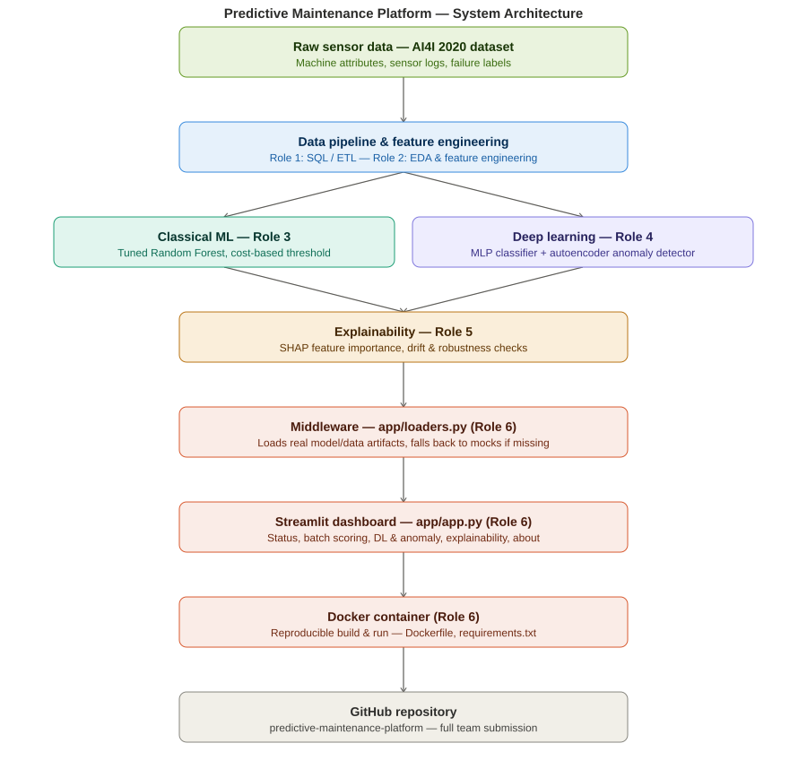

# README
# Predictive Maintenance — Data Engineering & SQL Database Layer

Data engineering component of the **Industrial Predictive Maintenance & Failure Prevention** project. This module owns cleaning the raw AI4I 2020 dataset, the normalized MySQL schema, the ETL pipeline, and the analytical SQL layer that downstream ML, monitoring, and dashboard components read from.

## Architecture



Data flows from the raw AI4I 2020 dataset through the SQL/ETL layer, into classical ML and deep learning models, through an explainability layer, and finally into the Streamlit dashboard, which is containerized with Docker.

## Contents
```
.
├── scripts/
│   └── etl.py                    # Main entry point: Extract -> Transform -> Load
├── sql/
│   ├── 00_local_setup.sql        # One-time: creates the database + app user
│   ├── 01_schema.sql             # Database schema (DDL)
│   └── 02_analytical_queries.sql # 12 analytical queries (CTEs, JOINs, window functions)
├── docs/
│   └── data_dictionary.md        # Column-level documentation + assumptions log
├── data/
│   └── ai4i2020_raw.csv          # Source dataset (UCI AI4I 2020)
├── requirements.txt
└── README.md
```
## Data source
[AI4I 2020 Predictive Maintenance Dataset](https://archive.ics.uci.edu/dataset/601/ai4i+2020+predictive+maintenance+dataset) (UCI Machine Learning Repository). 10,000 rows, fully synthetic, cross-sectional — each row is one independently-simulated machine observed once, not a time series of one physical machine. There is no timestamp column in the source data. This constraint shapes several schema and query design decisions documented in `docs/data_dictionary.md` — read that file before extending the schema or adding queries.

## Database schema
Six tables in the `predictive_maintenance` MySQL database:

| Table | Role |
|---|---|
| `machine_type` | Lookup: quality variant (Low/Medium/High) |
| `machines` | Dimension: one row per machine |
| `sensor_readings` | Fact: process-variable measurements |
| `failure_mode` | Lookup: the 5 specific failure mechanisms + an "unspecified" code |
| `failure_events` | Fact: long-format normalization of the source's wide binary failure flags |
| `maintenance_events` | Fact: synthesized corrective-maintenance log (flagged `is_synthetic=1`) — the source data has no real maintenance history |

Full DDL with rationale comments: `sql/01_schema.sql`. Full column-level reference: `docs/data_dictionary.md`.

## ETL pipeline
`scripts/etl.py` is the pipeline entry point:

- **Extract** — reads `data/ai4i2020_raw.csv`
- **Transform** — validates types/ranges, renames columns to snake_case, normalizes the wide failure-flag columns into the long-format `failure_events` table, synthesizes `maintenance_events`, and engineers a leakage-safe feature table for the ML track
- **Load** — applies `sql/01_schema.sql` if needed and bulk-loads all tables into MySQL

Outputs written to `data/`:

- `ai4i2020_clean.csv` — cleaned flat dataset
- `ml_feature_ready.csv` / `ml_feature_ready.npy` — feature matrix for the ML/DL track (`machine_failure` is the target column; no post-failure or failure-mode columns are included as predictors)

### Running it
```bash
pip install -r requirements.txt
mysql -u root -p < sql/00_local_setup.sql   # one-time: creates DB + app user
python scripts/etl.py
```
Connection settings (`DB_HOST`, `DB_PORT`, `DB_USER`, `DB_PASSWORD`, `DB_NAME`) are defined near the top of `scripts/etl.py` and default to match `sql/00_local_setup.sql`.

## Analytical SQL
`sql/02_analytical_queries.sql` contains 12 queries against the loaded schema, covering: failure-rate breakdowns by machine type, per-type sensor ranking and outlier detection (CTEs + STDDEV/z-scores), tool-wear-quartile failure analysis (NTILE), multi-mode failure detection, maintenance-gap analysis (LAG), moving averages (ROWS BETWEEN ... PRECEDING), percentile-based risk ranking (PERCENT_RANK), and a failure-cost feeder query for the business-simulation workstream. Run them with any MySQL client against the loaded database, e.g.:

```bash
mysql -u pm_user -p predictive_maintenance < sql/02_analytical_queries.sql
```

## Known data-quality note
27 source rows have Machine failure inconsistent with the five specific failure-mode flags — this is a documented characteristic of AI4I2020, not an ingestion error, and is preserved as ground truth in `failure_events` rather than corrected. See `docs/data_dictionary.md` for detail.

## Downstream handoff
- **ML track**: consume `data/ml_feature_ready.csv` / `.npy`, or query `failure_events` directly for per-failure-mode multi-class targets.
- **Monitoring / dashboard**: `sensor_readings`, `failure_events`, `maintenance_events` are queryable live in MySQL. Remember `maintenance_events` is synthetic.
- **Business simulation**: `sql/02_analytical_queries.sql` (query 12) provides a failure-cost starting point — its $5,000/failure constant is a placeholder and should be replaced with real or justified cost assumptions.
